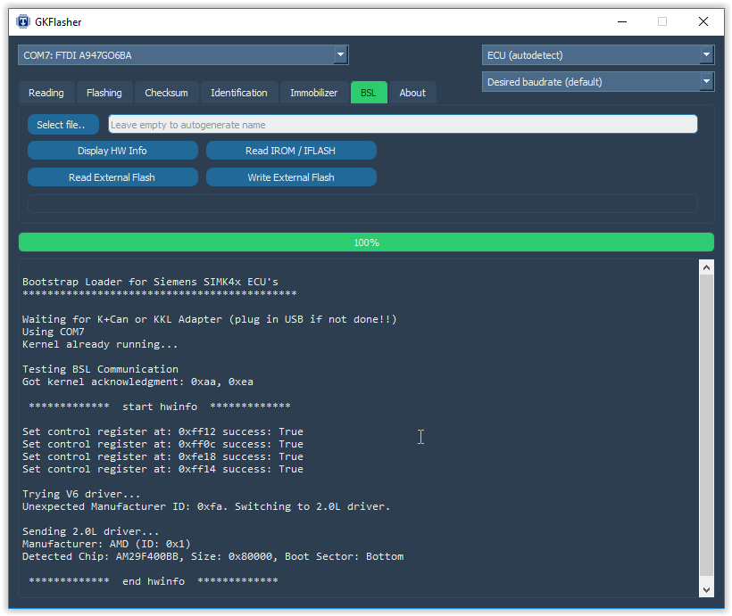
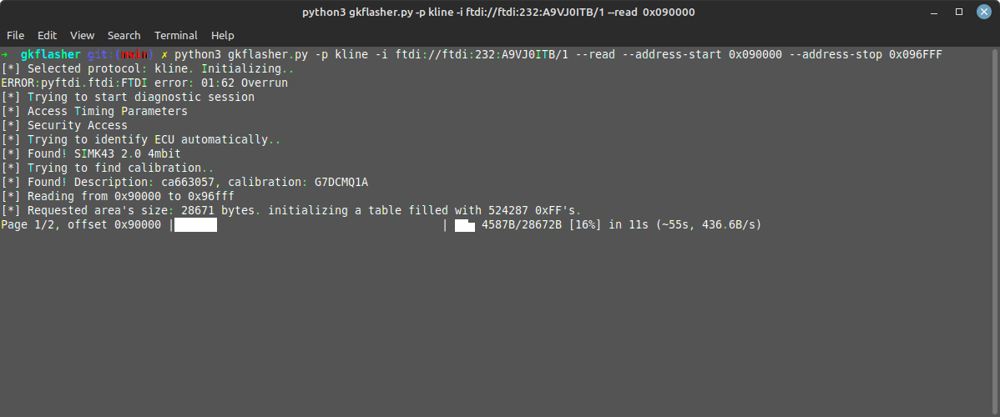

# GKFlasher

CLI flashing tool for SIMK41/43-based vehicles. This project is a result of research gathered by black-box reverse engineering.

It can read & write ecu calibration data / program code, correct EEPROM checksums, clear adaptive values and program the immobilizer. It also provides BSL support from your ECU.

This project is open source and supported by OpenGK

## Installation 

Clone the repository

`git clone https://github.com/Dante383/GKFlasher`

Install Python 3.10 for your specific operating system
https://www.python.org/downloads/release/python-31011/

Install required packages

`python3 -m pip install -r requirements.txt`

Confirm that no errors ocurred

Running the command `pip list` should show the following packages
-about-time
-alive-progress
-crcmod
-gkbus
-grapheme
-pyftdi
-PyQt5
-PyQt5-Qt5
-PyQt5-sip
-pyserial
-pyusb
-PyYAML
-setuptools

## Usage 

Connect your K-line or CANbus adapter to your computer and the vehicle (or ECU for bench setup).
Pinouts for the Tiburon can be found on https://opengk.org. 

### GUI

Launch `python3 gui.py` 

### CLI

Launch `python3 gkflasher.py --protocol {canbus/kline} --interface {can0//dev/ttyUSB0}`. If it detects EEPROM size and calibration - all is good, you can proceed! 

### Reading 

Add `--read` to the parameters. By default the output
will be saved to `output_{address start}_to_{address stop}.bin`. You can use `--output {filename}` to override that

You can use `--address_start` and `--address_stop` to only read a certain portion.

Be aware that GKFlasher will always pad the output with 0xFF's to match the EEPROM size. For example, reading 16384 bytes from 0x090000 to 0x094000 (calibration zone) on 
an 8mbit EEPROM will still result in a 1mb output file. 

### Flashing 

Add `--flash {filename}` to the parameters. GKFlasher will attempt to detect current ECU calibration version 
and the calibration version of the file you're trying to flash before asking you for confirmation.

You don't need to flash the whole bin at once. You can also use `--flash-calibration {filename}` and `--flash-program {filename}`

You can use `--address_start` and `--address_stop` to only overwrite a certain portion. Be aware that input file offsets must match with intended EEPROM offset. 
For example, if you want to flash only the calibration zone (0x090000 - 0x094000 on 8mbit eeprom) the calibration zone must be located at 0x090000 - 0x094000 in the input file.
This behaviour is followed by default by GKFlasher's --read command.

### Parameters 

`-c --config {filename}` - Load the config file (default: gkflasher.yml). You could use this for example to prepare different configurations for different vehicles you're working on.

`-p --protocol {protocol}` - Currently supported: `canbus` and `kline`

`-b --baudrate {baudrate}`

`--desired-baudrate {baudrate identifier}` - See ecu_definitions.py

`-i --interface {interface}`

`-r --read`

`--read-calibration` - Read just the calibration zone. You can always use `--address-start` and `--address-stop` manually - this just adjusts the offset based on the ECU for you

`--read-program` - Read just the program zone.

`--id` - display ECU identification parameters (KWP service 0x1A)

`--correct-checksum {filename}`

`--clear-adaptive-values`

`-o --output {filename}` - Filename to save the EEPROM dump

`-f --flash {input filename}`

`--flash-calibration {input filename}`

`--flash-program {input filename}`

`-s --address_start {offset}` - Offset to start reading/flashing from 

`-e --address_stop {offset}` - Offset to stop reading/flashing at

`--bin-to-sie {input filename}` - Convert BIN to SIE for (Chip-off) Flashing

`--sie-to-bin {input filename}` - Convert SIE to BIN after (Chip-off) Flashing

`--immo` - Immobilizer functions

`-v --verbose` - Enable debug logging

`-l --logger` - Start KWP2000 Datalogger 

